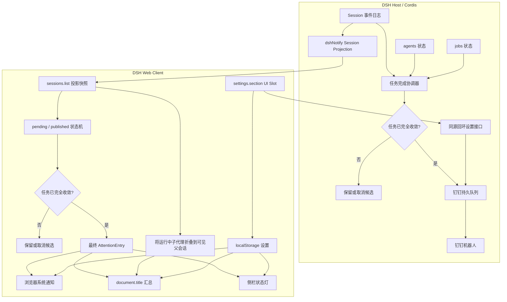

# @weekit/dsh-notify

[English](README_EN.md) | 简体中文

[](https://github.com/weekitmo/oh-my-dsh-plugins/actions/workflows/ci.yml) [](https://github.com/weekitmo/oh-my-dsh-plugins/releases/latest) [](LICENSE)

DeepSeek Harness 的任务状态通知插件。它在任务运行、完成或异常时，通过系统通知、浏览器 Tab 标题和左侧会话列表提供明确的状态提示。

## DSH 版本兼容性

当前版本要求 DeepSeek Harness `>=0.1.5-rc.2`。低于 `0.1.5-rc.2` 的 DSH 请使用旧版发布物 `v0.1.3`，不要安装当前 release 的 tarball。


- **系统通知**：仅在顶层任务全部收敛后发送完成、错误、中止、阻塞或 Token 限制结果；可在设置中单独关闭某一类。
- **等待授权提醒**：Agent 请求授权确认时立即弹出系统通知（审批请求不会结束 turn，因此走独立的 `approval/request` 链路），批准或拒绝的行为完全不变。
- **结果音效**：完成、错误、中止、阻塞、Token 限制与等待授权各有独立短音效，可整体关闭并调节音量；音效随客户端 bundle 内联，无需额外网络请求。
- **钉钉机器人**：配置 Access Token 与 Signing Secret，独立选择“成功 / 完成”或“失败 / 中止”消息，并支持免打扰和结束后错过消息汇总。
- **Tab 状态**：空闲时显示最近工作区会话标题；运行中显示 spinner 和会话数；完成或异常后显示未读结果计数。
- **侧栏状态灯**：会话完成且尚未查看时显示绿色圆点；错误、中止、阻塞或 Token 限制显示红色圆点；等待授权显示黄色圆点。打开会话后清除。
- **状态兼容**：执行中的会话保留 DSH 自带 loading，等待审批或回答时保留原生警告状态。
- **可配置**：可在 WebUI 的 **设置 > 通知** 中控制通知权限、Tab 动效、favicon、spinner、侧栏状态灯、结果类型与音效。

## 架构

`@weekit/dsh-notify` 是标准的 Cordis Host/Client 插件，不修改 DeepSeek Harness 核心。它使用 DSH 提供的 Session 事件、Session Projection、Client Runtime 和 UI Slot 扩展点；这里不是 `packages/hooks/*` 的外部 CLI hooks 适配器。



Host 入口通过 `ctx.sessionProjections.register(...)` 注册投影，并由协调器同时监听 Session、Agent 与 Job 生命周期；Client 入口订阅 `sessions.list`，每次快照变化都重新评估候选。两端都用可取消的短收敛窗口处理 job settle 后同步 followup 唤醒主 Agent 的竞态。

子代理 Session 带有 `origin: 'subagent'`。Host 的钉钉出口和浏览器端的系统通知、Tab 未读结果、侧栏状态灯都会在候选进入最终结果前过滤它，因此当前没有“子代理成功通知”开关。运行中的子代理仍折叠进可见父会话的运行计数。

`turn/end` 只产生待定候选，不直接表示完成。只有顶层主会话已 idle、该任务及其子代理后代没有 running/stopping job、没有运行中的子代理后代、没有 active 自动 goal，并且该轮没有未收敛异步委派时，候选才在短收敛窗口后发布。`de_coi_dispatch`、后台 subagent/bash、workflow/goal 等仍有未收敛委派的启动轮不会发布；如果同一轮已明确等待并收集全部终态，则该轮仍可作为最终汇总发布，否则由后续主 Agent 汇总轮覆盖旧候选并在收敛后通知。普通 GUI fork 没有 `origin: 'subagent'`，仍是可独立通知的任务。

## 安装

通过 GitHub 最新 Release 单独安装这个 scoped 包：

```sh
curl -fsSL https://github.com/weekitmo/oh-my-dsh-plugins/releases/latest/download/install.sh | sh -s -- @weekit/dsh-notify
```

安装器下载并校验预构建 tarball，然后加入 `web` profile。自定义 profile：

```sh
curl -fsSL https://github.com/weekitmo/oh-my-dsh-plugins/releases/latest/download/install.sh | sh -s -- @weekit/dsh-notify --profile my-profile
```

安装后刷新 WebUI。若插件没有自动加载，重启对应的 `dsh web` 进程后再刷新页面。完整参数见仓库根 [README](../../README.md)。

## 启用与使用

1. 打开 WebUI 的 **设置 > 通知**。
2. 开启需要的通知功能。
3. 如需系统通知，点击 **请求授权**，并在浏览器提示中允许通知。
4. 如需钉钉通知，在钉钉配置组打开官方文档创建自定义机器人，填写 Access Token 与 Signing Secret，选择需要发送的结果类型后保存。
5. 保持默认配置，或分别调整 Tab 提示、运行中 spinner、侧栏状态灯及结果类型。

钉钉的结果筛选独立于浏览器通知开关。关闭系统通知或本地某类结果，不会关闭已启用的钉钉分类。浏览器通知权限被拒后，网页无法再次强制弹出授权框；请从浏览器地址栏的站点权限设置中重新允许通知。

## 配置

浏览器侧设置保存在当前站点的 `localStorage`，默认配置如下：

| 设置 | 默认 |
| --- | --- |
| 系统通知 | 开 |
| 系统通知正文最大字符数 | 400（可设置 100–2000） |
| 子代理独立完成通知 | 关（固定；仅跟随父会话运行计数） |
| Tab 未读结果汇总 | 开 |
| Tab 运行中 spinner | 开 |
| Tab 空闲标题动效 | 开 |
| 空闲 hidden favicon 提示 | 关 |
| 侧栏绿/红状态灯 | 开 |
| 六类结果（含等待授权） | 全开 |
| 结果音效 | 开 |
| 结果音效音量 | 60（可设置 0–100，0 为静音） |
| 未读结果动画 | 跑马灯 |
| 钉钉成功 / 完成消息 | 开（配置凭据后生效） |
| 钉钉失败 / 中止消息 | 开（包含错误、阻塞、Token 限制） |
| 钉钉消息免打扰 | 关（默认时段 23:00-08:00） |
| 免打扰结束后错过消息汇总 | 关 |

钉钉凭据与策略保存在 `$DSH_HOME/dsh-notify/settings.json`，不会写入浏览器 `localStorage`，API 也不会把凭据回传给页面。凭据管理接口仅接受本机回环地址上的同源 WebUI 请求；通过局域网或公网地址访问 WebUI 时不能修改钉钉配置。免打扰固定按 `Asia/Shanghai` 判断，支持跨午夜；开启汇总后，期间消息会暂存到同目录的 `dingtalk-missed.json`，结束时合并为一条通知。普通任务结果也会在发送前短暂写入该持久队列，失败或重启后自动重试；交付采用 at-least-once 语义，极端崩溃窗口可能重复，但不会静默丢失。更换机器人凭据会在保存新凭据前清空旧队列，关闭结果分类也会移除对应待发消息。POSIX 系统使用 `0700` 目录和 `0600` 文件权限；Windows 依赖当前用户的文件 ACL，并继续拒绝符号链接和非普通文件。

系统通知正文最大字符数可直接在 dsh-notify 设置页调整，修改后立即生效。

### 结果音效

音效素材来自 Kenney 的 CC0 公开领域音效包 [Interface Sounds](https://kenney.nl/assets/interface-sounds)，原文件放在 `plugins/dsh-notify/assets/sounds/`（附授权说明），打包时会内联进 `lib/client.js` 的 `data:audio/ogg` URL，因此运行时不请求任何额外资源、也不读取插件目录。

| 结果 | 音效 |
| --- | --- |
| 完成 | `confirmation_001.ogg` |
| 错误 | `error_001.ogg` |
| 中止 | `close_002.ogg` |
| 阻塞 | `bong_001.ogg` |
| Token 限制 | `pluck_001.ogg` |
| 等待授权 | `question_002.ogg` |

设置页的 **试听** 按钮可以单独预览每个音效（忽略总开关，便于试听后再决定）。音效与系统通知开关相互独立：即使关闭系统通知弹窗，音效仍会播放；反之关闭音效也不影响通知弹窗。音效只跟随“通知结果”分类开关，被关闭的结果既不会弹窗也不会出声。浏览器在用户与页面产生交互前可能拒绝播放（`NotAllowedError`），此时会静默跳过并在控制台给出警告。

## 卸载

```sh
dsh plugin --profile web remove @weekit/dsh-notify
```

刷新页面；若插件仍然存在，重启对应的 `dsh web` 进程。

## 相关文档

- [安装说明](docs/installation.md)：monorepo 安装与手动安装命令。
- [开发说明](docs/development.md)：已知限制、本地开发和检查命令。
- [版本与发布](docs/releasing.md)：版本规范与维护者发布流程。

## License

MIT. See [LICENSE](LICENSE).
