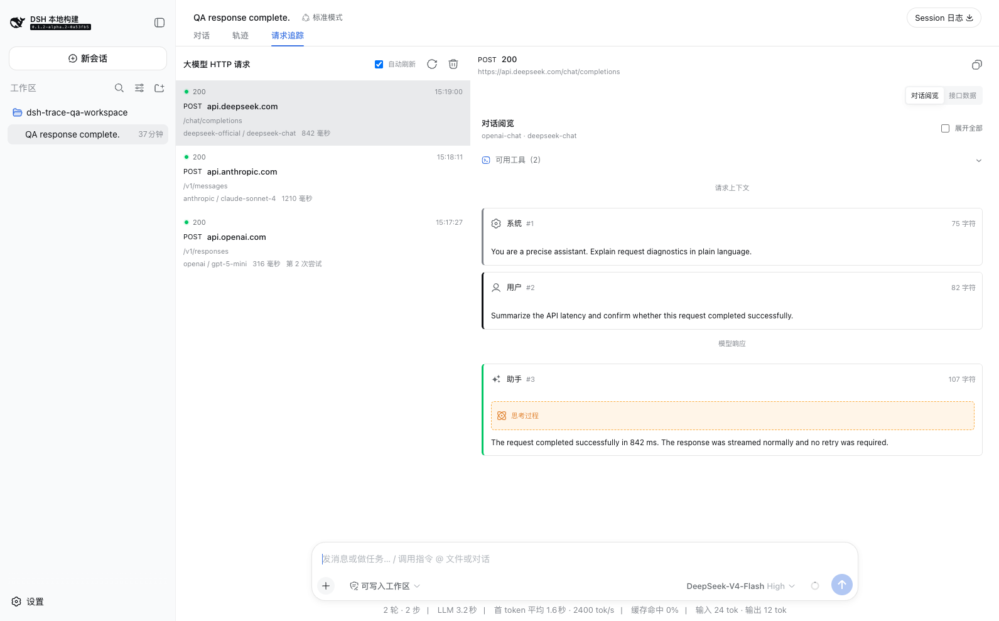
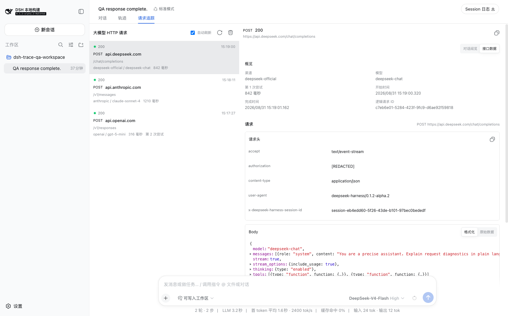
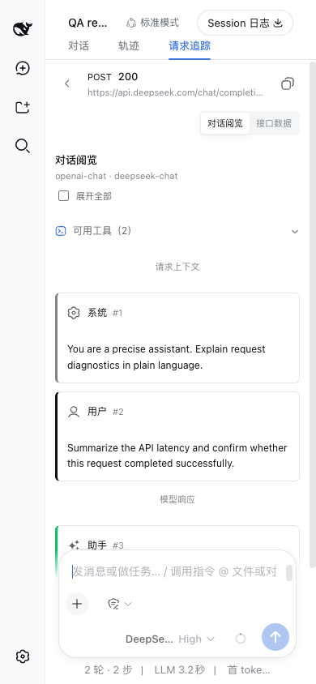

# @weekit/dsh-trace

`@weekit/dsh-trace` 是一个面向 [DeepSeek Harness](https://github.com/deepseek-ai/deepseek-harness) 的 Web 插件，为轨迹旁边增加 **请求追踪** Tab，把大模型请求从“黑盒调用”变成可检查的完整 HTTP 交换记录。

插件当前针对 DSH `0.1.2-alpha.2` 开发，界面沿用 DSH 的设计 Token，支持浅色、深色、跟随系统主题，以及桌面端和移动端布局。

## 效果预览

### 对话阅览

将已经捕获的请求体和响应体还原为可阅读的对话结构，显示请求上下文、模型响应、思考过程、工具定义、工具调用和工具结果。



### 接口数据

需要检查网络细节时，可以切换到接口数据，查看请求概览、请求头、响应头，以及格式化或原始的请求/响应 Body。



### 移动端

窄屏下自动切换为“请求列表 -> 请求详情”的进入和返回流程，不需要横向滚动。



## 功能

- 在 DSH 轨迹旁增加 `请求追踪` Tab，按当前会话筛选请求。
- 记录实际发出的 HTTP method、URL、请求头、请求体、响应状态、响应头、响应体、耗时和重试次数。
- 通过 `对话阅览`查看语义化请求和响应；通过 `接口数据`查看传输层原始数据和格式化数据。
- 支持 OpenAI Chat Completions、OpenAI Responses、Anthropic，以及常见 Gemini-compatible 请求和响应格式。
- 支持普通 JSON、SSE 流式响应、推理内容、工具调用、工具结果和附件标记。
- 请求列表支持自动刷新、手动刷新、游标分页、复制 URL、显示每条记录的保留截止时间，以及清空当前会话追踪记录。
- 桌面端列表和详情使用独立滚动区，默认不自动选中请求；移动端保持列表到详情的进入和返回流程。
- `请求上下文`和`可用工具`目录默认折叠，工具参数可以单独展开查看。
- 默认只保留最近 24 小时；设置使用 24 小时、3 天、7 天、自定义四段选择，自定义时可按小时或天输入。
- 主题跟随 DSH，支持浅色、深色和系统主题；详情页适配移动端。

模型渠道和模型目录不属于本插件的功能范围。DSH 已经在自带的 **设置** 页面提供模型配置，插件不会额外读取、发现或修改模型配置。请求追踪中显示的“渠道”和“模型”仅用于标识具体请求。

## 安装

通过 GitHub 最新 Release 单独安装：

```sh
curl -fsSL https://github.com/weekitmo/oh-my-dsh-plugins/releases/latest/download/install.sh | sh -s -- @weekit/dsh-trace
```

指定其他 profile：

```sh
curl -fsSL https://github.com/weekitmo/oh-my-dsh-plugins/releases/latest/download/install.sh | sh -s -- @weekit/dsh-trace --profile my-profile
```

安装完成后重启 DSH Web：

```sh
dsh web
```

插件自带 `cordis.patch.yml`，安装后会自动加入 Web profile 的组合包，不需要手动修改 DSH 配置。

从源码开发安装时，在 monorepo 根目录执行：

```sh
pnpm install --frozen-lockfile
pnpm --filter @weekit/dsh-trace run build
dsh plugin --profile web add ./plugins/dsh-trace
```

卸载插件：

```sh
dsh plugin --profile web remove @weekit/dsh-trace
```

## 使用方式

1. 打开一个已有内容的 DSH 会话。
2. 在会话顶部切换到 `请求追踪`。
3. 从左侧请求列表选择一次模型 HTTP 请求。
4. 在详情顶部切换 `对话阅览` 或 `接口数据`。

只有 DSH 在 `llm/stream` 上下文中通过 `globalThis.fetch` 发出的模型请求会被捕获。浏览器 RPC、工具调用和其他插件的 HTTP 请求不会进入此列表。一个逻辑请求的多次 provider 重试会作为独立的 HTTP attempt 显示，并保留相同的逻辑请求 ID。

## 保留时间设置

在 DSH **设置 > 通用 > 请求追踪保留时间** 中配置：

- 最近 24 小时
- 最近 3 天
- 最近 7 天
- 自定义数值，单位可选小时或天

默认值是 24 小时。设置通过 DSH Settings 服务写入 `$DSH_HOME/settings.yaml`，保存后立即生效，不需要重启。修改保留时间时会立即删除过期记录；查询本身也会按当前截止时间隐藏过期记录。DSH 运行期间每小时还会执行一次物理清理，即使没有新的模型请求也不会长期保留过期数据。

## 数据存储与性能

请求追踪数据存储在插件自己的 SQLite 数据库，不会混入 DSH 会话轨迹：

```text
$DSH_HOME/dsh-trace/requests.sqlite
```

未设置 `DSH_HOME` 时，DSH 默认使用 `~/.dsh`。目录和数据库文件使用 owner-only 权限。SQLite 使用 WAL、`synchronous=FULL` 和最长 5 秒的异步写锁重试；多个 DSH Web 进程共享同一个本地 `DSH_HOME` 时，可以并发读取并由 SQLite 正确串行化短写事务。WAL 不适用于不能可靠支持共享内存锁的网络文件系统。

存储和查询保持有界，并继续分离列表与详情：

- 每条完成的 HTTP attempt 在短事务中写入，不维护进程私有的文件 offset 或摘要缓存。
- 请求列表只查询摘要列，按 workspace、session、`startedAt + id` 游标分页；前端每页加载 80 条，RPC 上限为 200 条。
- 详情按 `id + session scope` 单独读取并解析完整的脱敏记录；列表自动刷新不会回传请求体或响应体。
- 默认最多保留 10,000 条记录，`maxStorageBytes` 限制 `record_json` 的 UTF-8 逻辑字节总量为 128 MiB；SQLite 文件、空闲页和 WAL sidecar 的物理大小可能暂时高于该值。
- retention、数量和逻辑容量清理都读取共享数据库状态，不依赖单进程缓存；普通请求路径不运行 `VACUUM`。
- 从旧版本升级时会读取相邻的 `requests.jsonl`，跳过损坏行，幂等导入后把旧文件归档为 `.migrated-*`。

升级前必须停止所有仍会写 `requests.jsonl` 的旧版 DSH 进程。SQLite 迁移支持新版进程之间的并发启动，但不承诺与旧 JSONL writer 滚动共存。

## 配置上限

保留时间建议通过 DSH 设置页面修改。其他存储和采集上限可以在 `$DSH_HOME/profiles/web/cordis.patch.yml` 中覆盖插件配置：

```yaml
- id: dsh-trace
  config:
    retentionHours: 24
    maxRequestBodyBytes: 1048576
    maxResponseBodyBytes: 4194304
    maxRecords: 10000
    maxStorageBytes: 134217728
```

配置项说明：

| 配置项 | 默认值 | 说明 |
| --- | ---: | --- |
| `retentionHours` | `24` | 保留时长，单位为小时；设置页面的值会覆盖它 |
| `maxRequestBodyBytes` | `1048576` | 单条请求 Body 的最大捕获字节数 |
| `maxResponseBodyBytes` | `4194304` | 单条响应 Body 的最大捕获字节数 |
| `maxRecords` | `10000` | SQLite 中最多保留的 HTTP attempt 数 |
| `maxStorageBytes` | `134217728` | 完整追踪 JSON 的 UTF-8 逻辑字节总量上限 |

所有配置项都必须是正的安全整数。修改采集字节上限或数量上限后需要重启插件所在的 DSH Web；修改保留时间可以直接通过设置页面生效。

## 脱敏与隐私

数据写入磁盘前会进行通用脱敏，包括：

- 常见凭据请求头；
- URL 查询参数中的凭据；
- 常见敏感 JSON 字段；
- 文本和 SSE 数据中可识别的凭据赋值；
- Google-compatible 的 API key 请求头。

脱敏只是防御措施，不是数据防泄漏边界。提示词、工具定义、模型输出、自定义请求头和业务 Payload 仍然可能包含隐私或敏感业务数据。请保护 `$DSH_HOME`，使用较短的保留时间，并在不再需要时通过请求追踪页面清空数据。

## 支持的查看内容

`对话阅览`直接基于已经脱敏的请求体和响应体生成，不会创建第二份持久化格式。已识别的内容包括：

- OpenAI Chat Completions 的 messages、最终响应、流式文本/推理增量和流式工具参数；
- OpenAI Responses 的 input/output items、文本增量、推理摘要、function call/result；
- Anthropic 的 system/messages、thinking、tool use/result 和流式 content block；
- 常见 Gemini-compatible 的 contents、candidates、文本/思考 parts、function call/response。

无法识别的 Payload 会保留在 `接口数据` 中，原始 JSON/SSE 和格式化数据仍然可以查看。

## 限制

- 只有在 DSH 执行 `llm/stream` 时调用 `globalThis.fetch` 的传输会被捕获；如果未来适配器使用其他 HTTP 客户端，需要额外的观察接入点。
- Body 从克隆后的流中读取，并受配置的字节上限约束。调用方可能已经收到响应后，追踪记录才完成写入。
- 请求追踪是官方轨迹的增强视图，不是 Session event，不会进入 Session 导出或 fork 历史。
- 页面中的清空操作只删除当前会话的追踪；其他会话和工作区数据保留不变。
- 多个进程共享数据库时应使用一致的 retention 和容量配置；任一进程执行清理都会按自己的当前配置作用于全局存储。

## 开发

```sh
pnpm install --frozen-lockfile
pnpm run check
pnpm test
pnpm run build
pnpm pack
```

`package.json` 中的依赖版本全部固定。构建产物写入 `lib/`，该目录由 Git 忽略。项目采用 [MIT License](LICENSE)。
